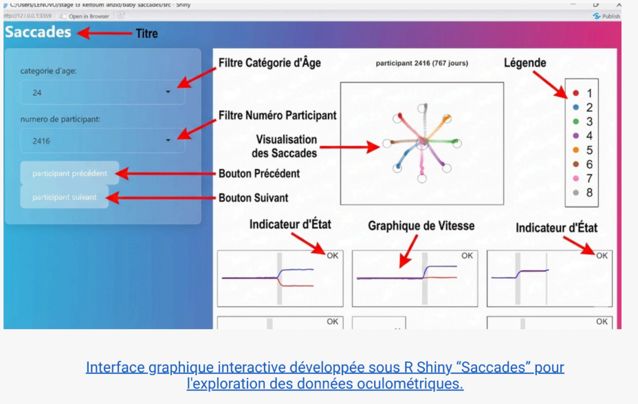

# Portfolio - Keltoum ANZID

Ce portfolio complète ma candidature en illustrant la mise en pratique des concepts théoriques abordés durant ma **Licence MIASHS** à l'Université Grenoble Alpes (UGA). 

Mon parcours m'a permis de développer une double compétence : la rigueur de l'analyse statistique et la maîtrise des outils de programmation. Les projets présentés ci-après témoignent de ma capacité à transformer des données brutes en informations exploitables.

---

## 🛠 Compétences Techniques

* **Programmation :** Python (Pandas, NumPy, Scikit-learn), R (Tidyverse, Shiny), Java, SQL.
* **Data Visualisation :** Power BI, Matplotlib, Seaborn, Dash.
* **Statistiques & Modélisation :** Régression linéaire/logistique, Tests d'hypothèses, Machine Learning.
* **Outils & Méthodes :** Git/GitHub, LaTeX, Méthodologies Agiles (Scrum).

---

## 📁 Projets Phares

### 1. Analyse et Prédiction des Prix Immobiliers (Modèle Hédonique)
*Projet académique - L3 MIASHS*
* **Objectif :** Analyser les déterminants du prix de l'immobilier et construire un modèle prédictif fiable.
* **Méthodologie :** Nettoyage de données, feature engineering, et évaluation de la performance ($RMSE$, $R^2$).
* **Outils :** R, Statistiques inférentielles.

### 2. Dashboards de Performance - Agri Data
*Stage - Analyse de données agricoles*
* **Objectif :** Optimiser le suivi des rendements et l'efficacité des traitements phytosanitaires.
* **Réalisation :** Création de dashboards interactifs pour le pilotage décisionnel et suivi des dépenses réelles vs prévisionnelles.
* **Outils :** Power BI, DAX, Excel.

### 3. Interface de Navigation avec R SHINY
*Projet stage *
* **Objectif :** une interface graphique avec R Shiny, conçue pour offrir une visualisation intuitive et interactive des données. Cette interface est déployée sur un serveur web afin de garantir un accès distant et sécurisé.
* **Outils :**R studio, R Shiny
* 
---

## 📈 Parcours & Engagement

Mon parcours témoigne de ma **persévérance** et de ma **capacité de travail**. Après une année de CPGE PCSI intensive, j'ai choisi de me réorienter vers la Licence MIASHS pour appliquer les mathématiques aux sciences humaines. Malgré un début de cycle marqué par des défis de santé que j'ai su surmonter, j'ai validé mes acquis avec détermination, retrouvant ainsi mon plein potentiel académique (Bac Mention Très Bien).

---

## 📫 Me contacter

* **Email :** [anzidkeltoum@gmail.com](mailto:anzidkeltoum@gmail.com)
* **LinkedIn :** [linkedin.com/in/keltoum-anzid](https://www.linkedin.com/in/votre-profil)
* **Localisation :** Grenoble, France
